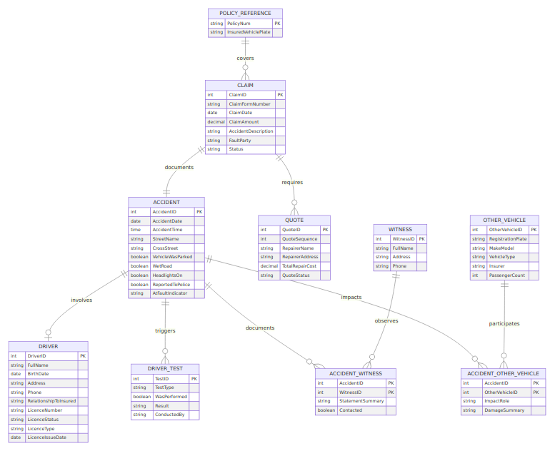

# Vehicle Claims Management System Database Design

**Premier University — Department of CSE**  
**Semester:** Spring 2025 (4th)  |  **Course:** CSE 2221 — Database Management Systems  |  **Course Outcome:** CO3  
**Assignment Weight:** 10 Marks  |  **Case Study:** Red Insurance — Vehicle Claim Form

---

## 1. Rationale for Choosing a Relational Database
- **Structured regulatory data**: Claims and accident records are highly regulated artifacts that demand strict schemas, auditability, and ACID guarantees that relational engines deliver out-of-the-box.
- **Complex relationships**: Policies, claims, accidents, witnesses, drivers, quotes, and other vehicles have well-defined cardinalities best captured via foreign keys, junction tables, and referential constraints.
- **Normalization & integrity**: Relational design plus normalization prevents update anomalies (e.g., repeating witness or quote sections) and enforces minimum data capture (three quotes per claim, one accident per claim).
- **Query flexibility**: SQL enables ad‑hoc analytics (loss ratios per policy, fraud indicators, repair network performance) without reshaping data.
- **Tooling ecosystem**: Mature RDBMS platforms integrate with reporting, ETL, and compliance systems already adopted by insurers.

---

## 2. Stakeholder Requirements and Data Abstractions

### 2.1 Key Stakeholders & Information Needs
- **Claims Intake Officers**: capture claim basics, ensure driver/witness data completeness, attach mandated quotes.
- **Assessors & Adjusters**: analyze accident context, fault, police interactions, and repair options.
- **Repair Network & Finance**: track approved quotes, reconcile payouts, audit cost variances.
- **Compliance & Risk**: verify legal obligations (tests performed, declarations), detect fraud, analyze repeat offenders.
- **Analytics / Management**: monitor claim volumes, recurrent other vehicles, loss patterns by policy or geography.

### 2.2 Entity & Attribute Catalog (Conceptual Model — No FKs Yet)

| Entity | Primary Identifier | Supporting Attributes | Notes |
| --- | --- | --- | --- |
| **PolicyReference** | PolicyNum | InsuredVehiclePlate | Read-only snapshot that links to enterprise policy system; only two items are persisted here per scope. |
| **Claim** | ClaimID (surrogate) | ClaimFormNumber (non-unique), ClaimDate, ClaimAmount, AccidentDescription, FaultParty, Status | Each claim references exactly one policy and one accident; internal ClaimID resolves the “claim number not unique” issue. |
| **Accident** | AccidentID | AccidentDate, AccidentTime, StreetName, CrossStreet, VehicleWasParkedFlag, WetRoadFlag, HeadlightsOnFlag, ReportedToPoliceFlag | 1‑to‑1 with Claim; stores context independent from claim metadata. |
| **Driver** | DriverID | FullName, BirthDate, Address, Phone, RelationshipToInsured, LicenceNumber, LicenceStatus, LicenceType, LicenceIssueDate | Only populated when the insured vehicle was being driven. |
| **Witness** | WitnessID | FullName, Address, Phone | May testify in zero, one, or many accidents. |
| **OtherVehicle** | OtherVehicleID | RegistrationPlate, MakeModel, VehicleType (vehicle/object/none), Insurer, PassengerCount | Represents any third-party vehicle/object involved; reusable across accidents. |
| **Quote** | QuoteID | QuoteSequence (1‑N), RepairerName, RepairerAddress, TotalRepairCost, QuoteStatus | Minimum of three quotes per claim captured in business rules. |
| **AccidentWitness** | (AccidentID + WitnessID) | StatementSummary, ContactedFlag | Resolves M:N between Accident and Witness. |
| **AccidentOtherVehicle** | (AccidentID + OtherVehicleID) | ImpactRole, AtFaultIndicator, DamageSummary | Resolves M:N between Accident and OtherVehicle; allows repeat participation. |
| **DriverTest** | TestID | TestType (Breath/Drug), WasPerformedFlag, Result, ConductedBy, AccidentID | Captures optional yet regulated testing outcomes without overloading Accident entity. |

Lookup tables (e.g., `LicenceStatus`, `FaultParty`, `QuoteStatus`) can be added later to enforce enumerations but are omitted here for brevity.

---

## 3. Conceptual ERD (Crow’s Foot Notation)
*(Conceptual model only — primary keys shown, no foreign keys drawn per instructions.)*

*Figure 1: Entity-relationship diagram generated from the conceptual schema.*

1. **PolicyReference (1) --< (M) Claim**  
   Each claim references exactly one existing policy record; policies can own many claims.

2. **Claim (1) --1 (1) Accident**  
   One accident generates one claim and vice versa; enforcing synchronized lifecycle.

3. **Accident (0..1) --1 Driver**  
   If the insured vehicle was driven, exactly one driver record attaches; if parked, no driver is linked.

4. **Accident (1) --< (M) DriverTest**  
   Multiple breath/drug tests may be logged per accident (e.g., initial + confirmatory).

5. **Accident (1) --< (M) AccidentWitness >--(M) Witness**  
   Many-to-many via associative entity; witnesses can observe multiple accidents or none.

6. **Accident (1) --< (M) AccidentOtherVehicle >--(M) OtherVehicle**  
   Supports collisions with several vehicles/objects and re-use of recurring offenders.

7. **Claim (1) --< (M) Quote**  
   At least three quotes per claim; additional quotes allowed for complex damages.

Mandatory vs. optional participation is illustrated by crow’s foot modality (single line for mandatory, circle for optional) in the actual ERD diagram to be printed from modeling software.

---

## 4. Normalization Workflow (Source: Insurance Claim Form)

1. **Unnormalized Form (UNF)**  
   The paper form mixes heterogeneous sections (policy, accident, driver, other vehicles, quotes, witnesses) with repeating groups (up to three quotes, unlimited witnesses) and optional segments (driver only when moving). Data anomalies: updating a witness phone number inside one form does not cascade; differing quote counts cause inconsistent rows.

2. **First Normal Form (1NF)**  
   - Separated repeating groups into individual tables: Quote, Witness, OtherVehicle.  
   - Ensured atomic attributes (e.g., split driver licence details into discrete fields, captured boolean flags for wet roads/headlights).  
   - Introduced surrogate identifiers (ClaimID, AccidentID) to provide primary keys for each collection.

3. **Second Normal Form (2NF)**  
   - Removed partial dependencies by introducing associative tables: AccidentWitness and AccidentOtherVehicle eliminate non-key dependency on composite (ClaimID + WitnessName).  
   - Driver-specific descriptors moved to Driver entity rather than sharing space within Accident, preventing partial reliance on accident attributes.

4. **Third Normal Form (3NF)**  
   - Eliminated transitive dependencies such as Policy details influencing claim rows by referencing PolicyReference.  
   - Validated that non-key attributes depend solely on the key (e.g., Quote cost depends only on QuoteID, not ClaimDate).  
   - DriverTest separated from Accident so test results do not repeat per accident attribute.

**Result**: All relations are in 3NF — no repeating groups, no partial dependencies on composite keys, and no transitive dependencies on non-key attributes.

---

## 5. Preliminary Relational Model (Logical Schema with PK/ FK notation)
*(Primary keys underlined; foreign keys suffixed with `*`. Optional FKs inherit modality from the ERD.)*

1. `PolicyReference(<u>PolicyNum</u>, InsuredVehiclePlate)`  
2. `Claim(<u>ClaimID</u>, ClaimFormNumber, ClaimDate, ClaimAmount, AccidentDescription, FaultParty, Status, PolicyNum*, AccidentID*)`  
3. `Accident(<u>AccidentID</u>, AccidentDate, AccidentTime, StreetName, CrossStreet, VehicleWasParkedFlag, WetRoadFlag, HeadlightsOnFlag, ReportedToPoliceFlag, AtFaultIndicator, DriverID*)`  
4. `Driver(<u>DriverID</u>, FullName, BirthDate, Address, Phone, RelationshipToInsured, LicenceNumber, LicenceStatus, LicenceType, LicenceIssueDate)`  
5. `DriverTest(<u>TestID</u>, TestType, WasPerformedFlag, Result, ConductedBy, AccidentID*)`  
6. `Quote(<u>QuoteID</u>, QuoteSequence, RepairerName, RepairerAddress, TotalRepairCost, QuoteStatus, ClaimID*)`  
7. `Witness(<u>WitnessID</u>, FullName, Address, Phone)`  
8. `AccidentWitness(<u>AccidentID</u>, <u>WitnessID</u>, StatementSummary, ContactedFlag)`  
9. `OtherVehicle(<u>OtherVehicleID</u>, RegistrationPlate, MakeModel, VehicleType, Insurer, PassengerCount)`  
10. `AccidentOtherVehicle(<u>AccidentID</u>, <u>OtherVehicleID</u>, ImpactRole, DamageSummary)`  

**Business rules** embedded via constraints/triggers:
- `Claim` must have exactly one `Accident` (`AccidentID` unique per claim and vice versa).
- `Quote` table enforces a CHECK that `QuoteSequence` is in {1,2,3,…} and a trigger to ensure at least three rows per ClaimID.
- `DriverID` in `Accident` is nullable but, when present, must reference an existing Driver with valid licence metadata.

---

## 6. Design Choices & Integrity Considerations
- **Surrogate vs. natural keys**: The original claim number cannot uniquely identify a claim. Introducing `ClaimID` prevents clashes and still preserves the externally supplied `ClaimFormNumber`.
- **Optional driver participation**: Storing `DriverID` as a nullable FK in `Accident` captures the parked scenario cleanly while preserving driver reuse across multiple accidents.
- **Associative entities for many-to-many relations**: Separate join tables preserve witness and other-vehicle reuse and allow additional attributes (statements, damage descriptions).
- **Regulatory testing capture**: `DriverTest` isolates optional test data, enabling multiple tests and audit trails without cluttering the `Accident` table.
- **Policy linkage kept minimal**: Only `PolicyNum` and `InsuredVehiclePlate` are stored to respect scope boundaries, while still supporting referential checks against the enterprise policy system.

---

## 7. Responses to Complex Problem-Solving Prompts
| Question | Response |
| --- | --- |
| **a. In-depth engineering knowledge?** | Yes — insurance claim processing demands understanding of regulatory constraints (e.g., mandatory quotes, evidentiary rules) and data governance. |
| **b. Wide-ranging or conflicting issues?** | Yes — balancing compliance, customer service, fraud prevention, and IT integration introduces competing priorities. |
| **c. Routine vs. abstract solution?** | Requires abstract modeling: translating an unstructured form into a normalized schema with optional relationships and multiplicities is not a rote exercise. |
| **d. Infrequently encountered issues?** | Handling non-unique claim numbers, optional drivers, and re-usable “other vehicles” are less common scenarios needing thoughtful design. |
| **e. Need for standards/codes?** | Strongly yes — insurance regulations, privacy laws, and corporate data standards must be observed (e.g., ACORD data codes, ISO claims best practices). |
| **f. Conflicting stakeholder requirements?** | Present — adjusters want maximal detail, but intake clerks need quick forms; IT favors strict validation whereas operations seek flexibility. |
| **g. Interdependent sub-problems?** | Definitely — driver, witness, quote, and accident sub-modules interlink; decisions about one (e.g., allowing multiple tests) affect schema elsewhere. |

---

## 8. Conclusion & Next Steps
- The proposed relational design satisfies all assignment objectives: stakeholder analysis, conceptual ERD (Figure 1), normalization through 3NF, relational schema conversion, and reflective design discussion.
- Recommended follow-ups: enrich the model with lookup/reference tables, derive physical DDL plus integrity constraints, and seed sample data to test workflow scenarios before deployment.

*Prepared by: [Your Name], Database Management Systems (CSE 2221) — Spring 2025.*

