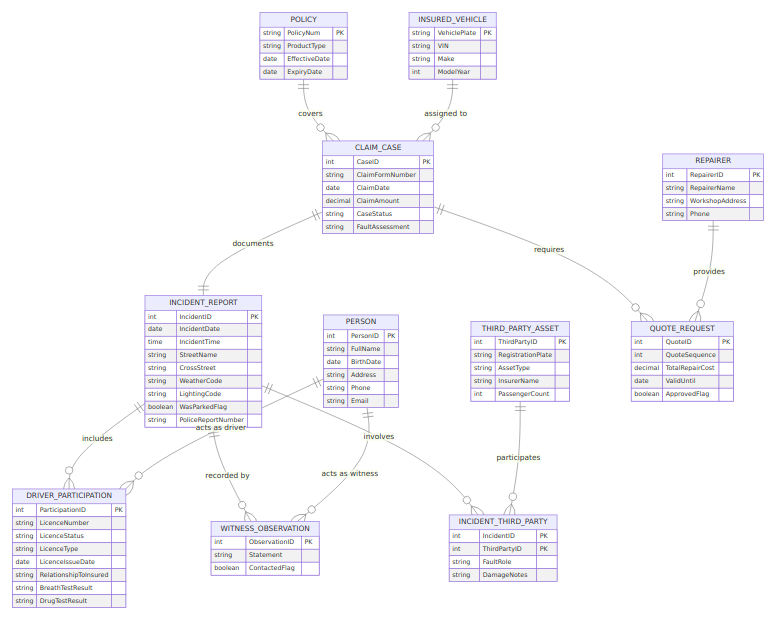

# Vehicle Claims Management System — Solution Variant A (Person-Centric)

**Premier University — Department of CSE**  
**Semester:** Spring 2025 (4th)  |  **Course:** CSE 2221 — Database Management Systems  |  **Course Outcome:** CO3  
**Assignment Weight:** 10 Marks  |  **Case Study:** Red Insurance — Vehicle Claim Form

---

## 1. Why a Relational DB Fits This Variant
- **Role-centric reuse of parties**: Drivers, witnesses, repairers, and policy contacts all originate from a unified `Person` catalog; relational joins and constraints keep their roles consistent.
- **Regulatory auditing**: Separation of `ClaimCase`, `IncidentReport`, and `DriverParticipation` enables ACID-compliant traces for hearings or litigation.
- **Declarative validation**: CHECK constraints on participation roles (driver vs witness) and reference integrity between `Policy`, `InsuredVehicle`, and `ClaimCase` work best in SQL.
- **Scalable analytics**: Normalized dimensions (street, driver status, test results) make aggregate queries straightforward without denormalizing.

---

## 2. Entities & Attributes (Conceptual, No FKs)

| Entity | Identifier | Key Attributes | Notes |
| --- | --- | --- | --- |
| **Policy** | PolicyNum | ProductType, EffectiveDate, ExpiryDate | Imported reference; still stored for validation. |
| **InsuredVehicle** | VehiclePlate | VIN, Make, ModelYear | Captures the insured asset once; referenced by claims. |
| **ClaimCase** | CaseID (surrogate) | ClaimFormNumber (non-unique), ClaimDate, ClaimAmount, CaseStatus, FaultAssessment | One-to-one with submitted claim form. |
| **IncidentReport** | IncidentID | IncidentDate, IncidentTime, StreetName, CrossStreet, WeatherCode, LightingCode, WasParkedFlag, PoliceReportNumber | Detailed conditions of the accident. |
| **Person** | PersonID | FullName, BirthDate, Address, Phone, Email | Master record for anyone referenced (driver, witness, repairer contact). |
| **DriverParticipation** | ParticipationID | LicenceNumber, LicenceStatus, LicenceType, LicenceIssueDate, RelationshipToInsured, BreathTestResult, DrugTestResult | Connects `Person` to `IncidentReport` with role DRIVER when vehicle was moving. |
| **WitnessObservation** | ObservationID | Statement, ContactedFlag | Join between `Person` and `IncidentReport` for witnesses. |
| **ThirdPartyAsset** | ThirdPartyID | RegistrationPlate, AssetType (Vehicle/Object), InsurerName, PassengerCount | Represents external vehicles or objects struck. |
| **IncidentThirdParty** | (IncidentID + ThirdPartyID) | FaultRole, DamageNotes | Resolves M:N between incidents and third-party assets. |
| **QuoteRequest** | QuoteID | QuoteSequence, TotalRepairCost, ValidUntil, ApprovedFlag | Each claim stores multiple quote records. |
| **Repairer** | RepairerID | RepairerName, WorkshopAddress, Phone | Linked to quotes; may appear across claims. |

---

## 3. Conceptual ERD (Crow’s Foot)

  
*Figure A1: Person-centric conceptual ERD.*

Narrative highlights:
1. **Policy (1) --< (M) ClaimCase**: multiple claims can reference the same policy lifecycle.
2. **InsuredVehicle (1) --< (M) ClaimCase**: vehicle plate stored once, referenced by cases.
3. **ClaimCase (1) --1 (1) IncidentReport**: maintained as separate tables for audit clarity.
4. **IncidentReport (0..1) --< (M) DriverParticipation >--(1) Person**: optional because the vehicle might have been parked.
5. **IncidentReport (1) --< (M) WitnessObservation >--(1) Person**: witnesses are persons playing a different role.
6. **IncidentReport (1) --< (M) IncidentThirdParty >--(1) ThirdPartyAsset**: any number of other vehicles/objects.
7. **ClaimCase (1) --< (M) QuoteRequest --(1) Repairer**: at least three quotes per claim; repairers reused.

---

## 4. Normalization Trail
1. **UNF**: Original form mixes people, quotes, and incident fields with repeating witness/quote sections. Composite section headings are unstructured.
2. **1NF**: Moved repeating groups (quotes, witnesses, other vehicles) into their own tables; introduced surrogate keys (CaseID, IncidentID) and atomic Boolean fields for wet road, headlights, parked flag.
3. **2NF**: Eliminated partial dependencies by creating associative tables: `IncidentThirdParty` and `WitnessObservation` remove reliance on composite identifiers such as (IncidentID, RegistrationPlate). `Person` ensures driver attributes don’t partially depend on ClaimCase keys.
4. **3NF**: Removed transitive dependencies—Policy attributes no longer sit inside claim rows; driver licence fields exist only in `DriverParticipation`; `Repairer` info is independent of Quote amounts. Each non-key attribute depends on the key, the whole key, and nothing but the key.

---

## 5. Relational Model (PK underlined, FK with asterisk)
1. `Policy(<u>PolicyNum</u>, ProductType, EffectiveDate, ExpiryDate)`  
2. `InsuredVehicle(<u>VehiclePlate</u>, VIN, Make, ModelYear)`  
3. `ClaimCase(<u>CaseID</u>, ClaimFormNumber, ClaimDate, ClaimAmount, CaseStatus, FaultAssessment, PolicyNum*, VehiclePlate*, IncidentID*)`  
4. `IncidentReport(<u>IncidentID</u>, IncidentDate, IncidentTime, StreetName, CrossStreet, WeatherCode, LightingCode, WasParkedFlag, PoliceReportNumber)`  
5. `Person(<u>PersonID</u>, FullName, BirthDate, Address, Phone, Email)`  
6. `DriverParticipation(<u>ParticipationID</u>, LicenceNumber, LicenceStatus, LicenceType, LicenceIssueDate, RelationshipToInsured, BreathTestResult, DrugTestResult, IncidentID*, PersonID*)`  
7. `WitnessObservation(<u>ObservationID</u>, Statement, ContactedFlag, IncidentID*, PersonID*)`  
8. `ThirdPartyAsset(<u>ThirdPartyID</u>, RegistrationPlate, AssetType, InsurerName, PassengerCount)`  
9. `IncidentThirdParty(<u>IncidentID</u>, <u>ThirdPartyID</u>, FaultRole, DamageNotes)`  
10. `Repairer(<u>RepairerID</u>, RepairerName, WorkshopAddress, Phone)`  
11. `QuoteRequest(<u>QuoteID</u>, QuoteSequence, TotalRepairCost, ValidUntil, ApprovedFlag, CaseID*, RepairerID*)`

Business constraints: enforce a trigger to require at least three `QuoteRequest` rows per `CaseID`; `DriverParticipation` rows prohibited when `WasParkedFlag=TRUE`; `IncidentThirdParty` registration plates unique per incident.

---

## 6. Design Rationale
- **Single party master**: Avoids duplicate person records when the same individual is both a driver and a witness in separate incidents.
- **Vehicle normalization**: Insured vehicle details are read from the policy system yet persisted for historical queries even if the enterprise record changes later.
- **Separated driver tests**: Breath/drug results stored with participation row to keep chronology intact and support multi-test scenarios.
- **Repair network insights**: Splitting `Repairer` from `QuoteRequest` lets finance compare vendor performance.

---

## 7. Complex Problem-Solving Prompt Responses
Same reasoning as before applies but with nuances:
- **a)** Requires knowledge of party-role modeling and insurance compliance.  
- **b)** Conflicts arise between data minimization (person master) and operational speed.  
- **c)** Abstract thinking needed to reconcile optional drivers with normalized schemas.  
- **d)** Handling parked vehicles with no driver yet still logging tests is uncommon.  
- **e)** Standards (ACORD, ISO) still dictate code sets used in `WeatherCode`, `LightingCode`.  
- **f)** Stakeholders clash over reusing person profiles vs. allowing quick anonymous entries.  
- **g)** Decisions about `Person` entity cascade into every sub-problem (witness, driver, repairer integrations).

---

## 8. Conclusion
- Variant A demonstrates a person-centric relational approach satisfying the rubric: requirement analysis, ERD, normalization, relational mapping, and reflective reasoning.
- Next technical steps: seed example data, add lookup tables for `WeatherCode`/`LightingCode`, and implement stored procedures enforcing quote minimums.

*Prepared by: [Your Name], Database Management Systems (CSE 2221) — Spring 2025.*

