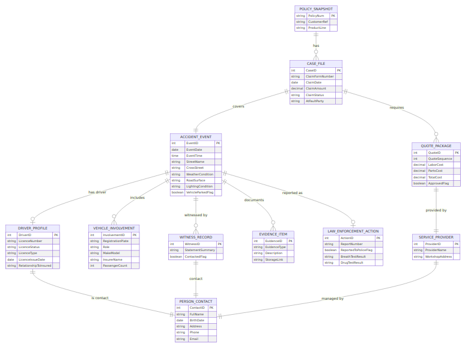

# Vehicle Claims Management System — Solution Variant B (Event & Evidence Centric)

**Premier University — Department of CSE**  
**Semester:** Spring 2025 (4th)  |  **Course:** CSE 2221 — Database Management Systems  |  **Course Outcome:** CO3  
**Assignment Weight:** 10 Marks  |  **Case Study:** Red Insurance — Vehicle Claim Form

---

## 1. Relational Strategy for the Event/Evidence Model
- **Temporal accuracy**: `PolicySnapshot` and `CaseFile` maintain historical facts as of claim time, something relational databases handle via triggers and transactions.
- **Complex optional sections**: `VehicleInvolvement`, `WitnessRecord`, and `EvidenceItem` are optional yet linked through foreign keys to keep referential integrity.
- **Compliance artifacts**: `LawEnforcementAction` records breath/drug tests plus reporting outcomes; relations guarantee they connect to the proper event.
- **Reporting agility**: SQL views can produce incident timelines or evidence matrices without duplicating information.

---

## 2. Entity Inventory (Conceptual Level)

| Entity | Identifier | Core Attributes | Notes |
| --- | --- | --- | --- |
| **PolicySnapshot** | PolicyNum | CustomerRef, ProductLine | Minimal data retained per scope. |
| **CaseFile** | CaseID | ClaimFormNumber, ClaimDate, ClaimAmount, ClaimStatus, AtFaultParty | One-to-one with submitted claim; ties to policy and event. |
| **AccidentEvent** | EventID | EventDate, EventTime, StreetName, CrossStreet, WeatherCondition, RoadSurface, LightingCondition, VehicleParkedFlag | Canonical representation of the accident. |
| **PersonContact** | ContactID | FullName, BirthDate, Address, Phone | Shared by drivers, witnesses, and service providers. |
| **DriverProfile** | DriverID | LicenceNumber, LicenceStatus, LicenceType, LicenceIssueDate, RelationshipToInsured | Reference to `PersonContact`. |
| **VehicleInvolvement** | InvolvementID | RegistrationPlate, Role (Insured/ThirdParty/Object), MakeModel, InsurerName, PassengerCount | Links a specific vehicle/object to the event. |
| **WitnessRecord** | WitnessID | StatementSummary, ContactedFlag | Join between event and contact. |
| **EvidenceItem** | EvidenceID | EvidenceType (Photo/Quote/Doc), Description, StorageLink | optional attachments per event. |
| **LawEnforcementAction** | ActionID | ReportNumber, ReportedToPoliceFlag, BreathTestResult, DrugTestResult | One row per event capturing policing outcomes. |
| **ServiceProvider** | ProviderID | ProviderName, WorkshopAddress, ContactID | Distinct table to manage vendor metadata. |
| **QuotePackage** | QuoteID | QuoteSequence, LaborCost, PartsCost, TotalCost, ApprovedFlag | Each claim requires >= 3 quotes; references provider. |

---

## 3. ERD Narrative (Crow’s Foot)

  
*Figure B1: Event & evidence centric ERD.*

Relation summary:
1. **PolicySnapshot (1) --< (M) CaseFile**: A policy can have multiple case files over time.
2. **CaseFile (1) --1 (1) AccidentEvent**: ensures every claim references exactly one event.
3. **AccidentEvent (0..1) --1 DriverProfile --(1) PersonContact**: driver optional when vehicle parked; driver references a contact record for reuse.
4. **AccidentEvent (1) --< (M) VehicleInvolvement**: includes both insured and other parties, differentiated via `Role`.
5. **AccidentEvent (1) --< (M) WitnessRecord --(1) PersonContact**: many witnesses, each tied back to a contact entry.
6. **AccidentEvent (1) --< (M) EvidenceItem**: optional documents, photos, or quotes.
7. **AccidentEvent (1) --1 LawEnforcementAction**: each event optionally records police interaction; stored separately for clarity.
8. **CaseFile (1) --< (M) QuotePackage --(1) ServiceProvider --(1) PersonContact**: ensures vendor reuse and structured quote data.
9. **VehicleInvolvement** rows referencing insured role must map back to the vehicle on the original policy via the `RegistrationPlate`.

---

## 4. Normalization Steps
1. **UNF**: Paper form lumps parking info, driver section, police section, quotes, and witnesses with repeating lines (three quotes, unlimited witnesses).  
2. **1NF**: Created atomic tables for quotes, witnesses, evidence; removed repeating groups and structured boolean fields (`VehicleParkedFlag`, `ReportedToPoliceFlag`).  
3. **2NF**: Moved driver licence details to `DriverProfile`, preventing partial dependency on event attributes; `VehicleInvolvement` isolates per-vehicle data rather than repeating within CaseFile.  
4. **3NF**: `ServiceProvider` and `PersonContact` remove transitive dependencies (e.g., repairer phone no longer depends on Quote). `LawEnforcementAction` holds breath/drug test fields independent of other accident data, ensuring every non-key attribute depends solely on its key.

---

## 5. Relational Model
1. `PolicySnapshot(<u>PolicyNum</u>, CustomerRef, ProductLine)`  
2. `CaseFile(<u>CaseID</u>, ClaimFormNumber, ClaimDate, ClaimAmount, ClaimStatus, AtFaultParty, PolicyNum*, EventID*)`  
3. `AccidentEvent(<u>EventID</u>, EventDate, EventTime, StreetName, CrossStreet, WeatherCondition, RoadSurface, LightingCondition, VehicleParkedFlag)`  
4. `PersonContact(<u>ContactID</u>, FullName, BirthDate, Address, Phone, Email)`  
5. `DriverProfile(<u>DriverID</u>, LicenceNumber, LicenceStatus, LicenceType, LicenceIssueDate, RelationshipToInsured, ContactID*)`  
6. `VehicleInvolvement(<u>InvolvementID</u>, RegistrationPlate, Role, MakeModel, InsurerName, PassengerCount, EventID*)`  
7. `WitnessRecord(<u>WitnessID</u>, StatementSummary, ContactedFlag, EventID*, ContactID*)`  
8. `EvidenceItem(<u>EvidenceID</u>, EvidenceType, Description, StorageLink, EventID*)`  
9. `LawEnforcementAction(<u>ActionID</u>, ReportNumber, ReportedToPoliceFlag, BreathTestResult, DrugTestResult, EventID*)`  
10. `ServiceProvider(<u>ProviderID</u>, ProviderName, WorkshopAddress, ContactID*)`  
11. `QuotePackage(<u>QuoteID</u>, QuoteSequence, LaborCost, PartsCost, TotalCost, ApprovedFlag, CaseID*, ProviderID*)`

Integrity notes: `VehicleInvolvement` must contain exactly one row flagged as Role='Insured'; `QuotePackage` requires a CHECK enforcing positive costs and a trigger to ensure at least three quotes per CaseID; `LawEnforcementAction` rows optional but when present must have consistent `ReportNumber`.

---

## 6. Design Considerations
- **Event vs Case separation**: Maintains legal audit trails; event data can be shared across reinsurers without exposing financial claim info.
- **Evidence attachments**: `EvidenceItem` future-proofs for photos, police PDFs, or IoT sensor logs.
- **Vendor management**: `ServiceProvider` tied to `PersonContact` so finance can contact the right representative even if workshops rebrand.
- **Vehicle role generalization**: Same table handles insured, other vehicles, and stationary objects, simplifying analytics on collision partners.

---

## 7. Responses to Complex Problem Questions
- **(a)** Requires domain expertise in insurance event modeling and evidence handling.  
- **(b)** Conflicts include balancing compliance requirements (store everything) with privacy (store minimal personal info).  
- **(c)** Converting semi-structured forms into an event/evidence schema demands abstract thinking.  
- **(d)** Rare scenarios (no driver, multiple evidence types) are handled via optional tables.  
- **(e)** Standards such as ACORD Evidence and ISO police codes inform enumerations.  
- **(f)** Stakeholders disagree over mandatory evidence uploads vs. speedy claim intake.  
- **(g)** Evidence, law-enforcement, and quote sub-problems interrelate (e.g., breath test results affecting quote approvals).

---

## 8. Conclusion
- Variant B proves an alternative yet fully compliant relational design emphasising event lineage and evidence governance.
- Future enhancements: add lookup tables for roles/conditions, implement cascading logic for insured vehicle validation, and automate PDF merging of evidence.

*Prepared by: [Your Name], Database Management Systems (CSE 2221) — Spring 2025.*

