# Smart System Diagrams

Each subsection contains a high-level block diagram and an operational flowchart drawn with Mermaid. Render them in any Markdown viewer that supports Mermaid to see the visuals.

---

## Smart waste management system

**Block Diagram**
```mermaid
graph LR
    bin[Smart Bin Sensors\n(ultrasonic, weight, GPS)]
    mcu[Edge MCU/\nController]
    net[LPWAN/\nCellular Gateway]
    cloud[Cloud Platform\nAnalytics & Storage]
    dash[Municipal Dashboard]
    fleet[Collection Fleet]
    bin --> mcu --> net --> cloud --> dash --> fleet
    dash -->|Route updates| fleet
```

**Flowchart**
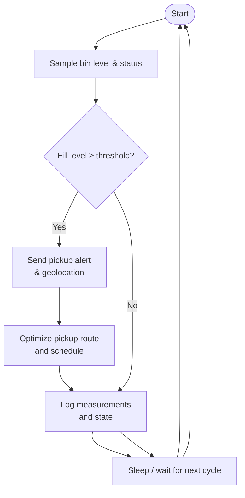

---

## Smart water level monitoring system

**Block Diagram**
```mermaid
graph LR
    sensor[Ultrasonic / Pressure\nLevel Sensors]
    ctrl[Low-power MCU\nwith ADC]
    power[Power Module\n(Solar + Battery)]
    comm[IoT Communication\n(LPWAN/Wi-Fi)]
    cloud[Cloud Server\nReal-time Dashboard]
    user[User Alerts\n(SMS/App)]
    sensor --> ctrl
    power --> ctrl
    ctrl --> comm --> cloud --> user
```

**Flowchart**
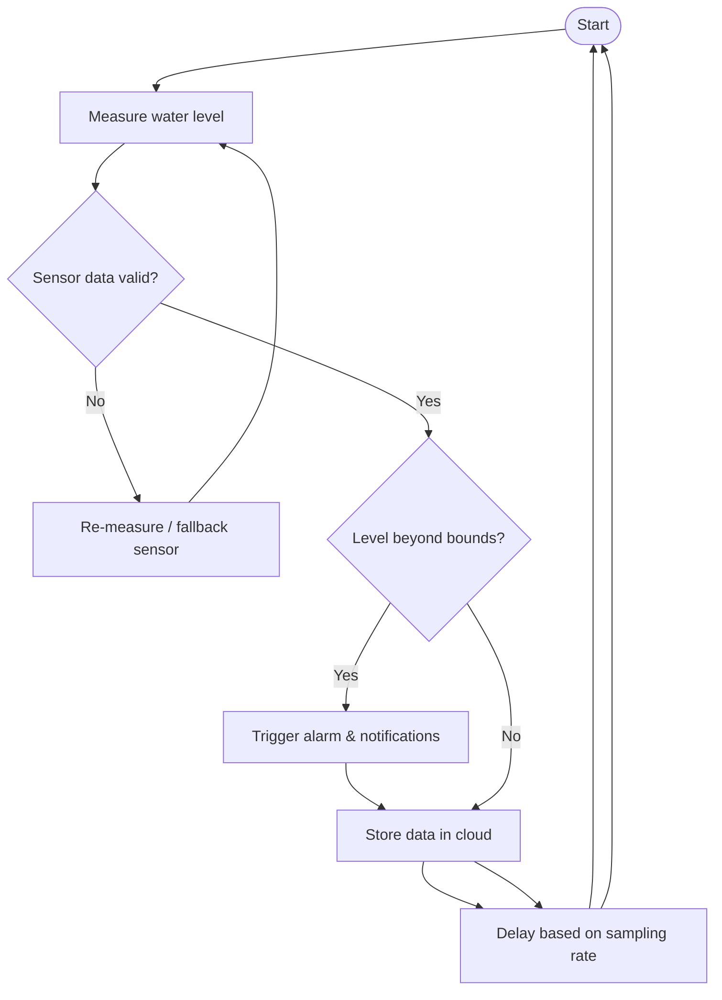

---

## Smart car parking system

**Block Diagram**
```mermaid
graph LR
    entry[Entry/Exit Sensors]
    slot[Slot Occupancy Sensors]
    ctrl[Parking Controller\n(Edge Server)]
    sign[LED Guidance Display]
    pay[Payment Terminal/App]
    cloud[Cloud Mgmt & DB]
    security[Security/Operator Console]
    entry --> ctrl
    slot --> ctrl
    ctrl --> sign
    ctrl --> pay
    ctrl --> cloud --> security
```

**Flowchart**
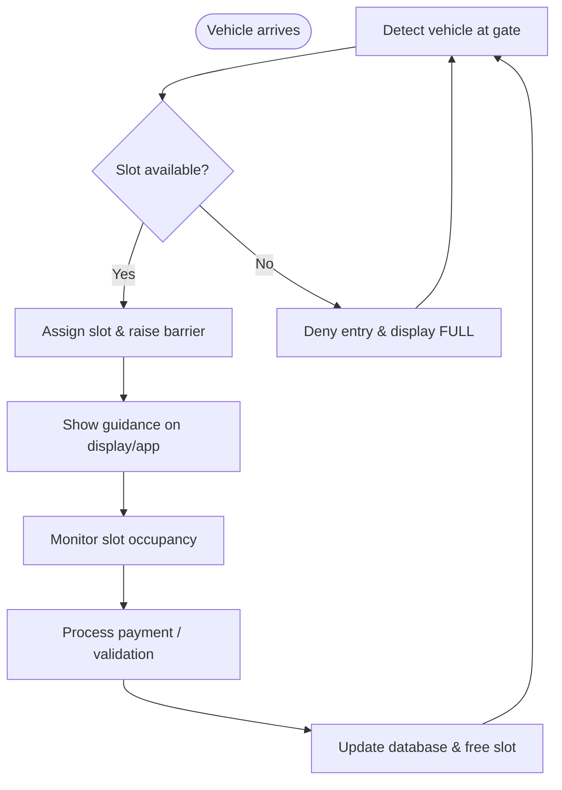

---

## Smart classroom monitoring system

**Block Diagram**
```mermaid
graph LR
    env[Environment Sensors\n(CO₂, temp, light)]
    attendance[Attendance Devices\n(RFID/Face ID)]
    cam[IP Cameras]
    edge[Edge Gateway]
    cloud[School Cloud\nAnalytics & DB]
    teacher[Teacher Dashboard]
    hvac[Smart HVAC / Lighting]
    env --> edge
    attendance --> edge
    cam --> edge
    edge --> cloud --> teacher
    teacher --> hvac
```

**Flowchart**
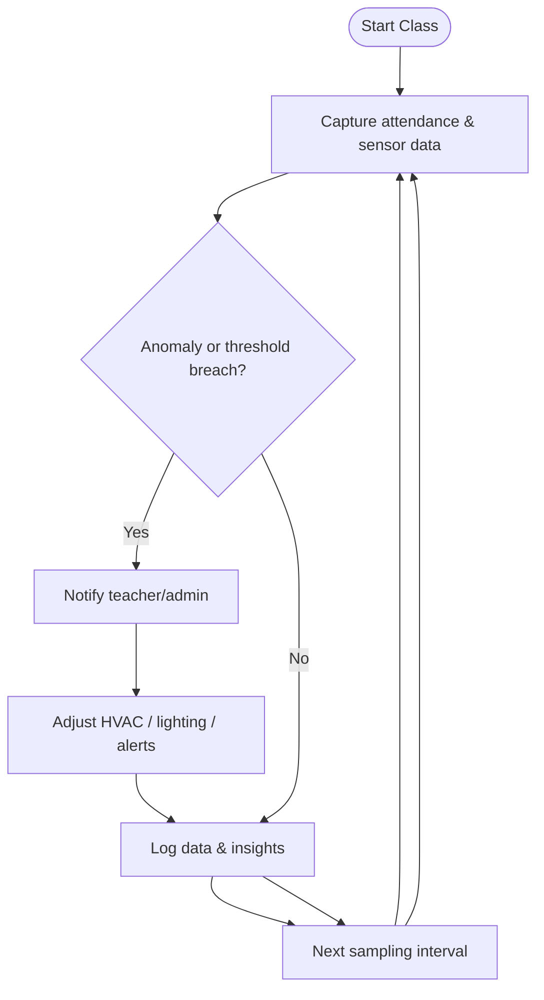

---

## Smart rail accident prevention system

**Block Diagram**
```mermaid
graph LR
    track[Track & Obstacle Sensors]
    onboard[Onboard Controller\n(Train ECU)]
    v2x[V2X / LTE-R Communication]
    ctrl[Rail Control Center]
    alert[Driver HMI & Auto Brake]
    emergency[Emergency Services]
    track --> onboard --> v2x --> ctrl --> emergency
    ctrl --> alert
    onboard --> alert
```

**Flowchart**
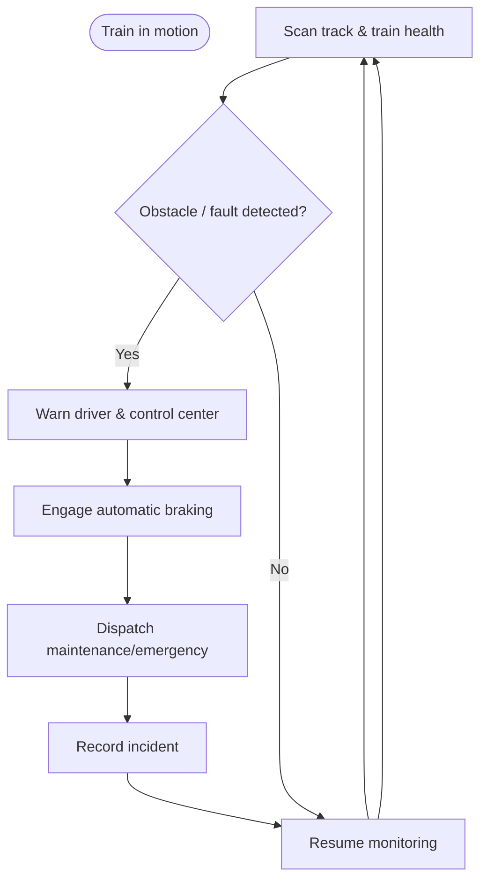

---

## Smart laboratory management system

**Block Diagram**
```mermaid
graph LR
    access[Access Control\n(RFID/Biometrics)]
    inventory[Inventory Sensors\n(Weight, RFID tags)]
    equip[Smart Equipment\nStatus Feeds]
    edge[Lab Controller / Gateway]
    db[Lab Management Server & DB]
    ui[Lab Manager Portal]
    vendors[Supplier API]
    access --> edge --> db --> ui
    inventory --> edge
    equip --> edge
    db --> vendors
```

**Flowchart**
```mermaid
flowchart TD
    start([Start of session])
    auth[Authenticate user & log entry]
    record[Record equipment usage]
    updateInv[Update chemical/equipment inventory]
    checkLvl{Stock below reorder point?}
    reorder[Trigger vendor reorder request]
    report[Generate usage & safety report]
    end([End session / standby])
    start --> auth --> record --> updateInv --> checkLvl
    checkLvl -- Yes --> reorder --> report --> end --> start
    checkLvl -- No --> report --> end --> start
```

---

## Home automation system

**Block Diagram**
```mermaid
graph LR
    sensors[Home Sensors\n(temp, motion, doors)]
    hub[Smart Hub / Edge Controller]
    cloud[Cloud Services\nVoice Assistants]
    actuators[Actuators\n(lights, HVAC, locks)]
    user[Mobile App / Voice UI]
    sensors --> hub --> actuators
    hub --> cloud --> user
    user --> hub
```

**Flowchart**
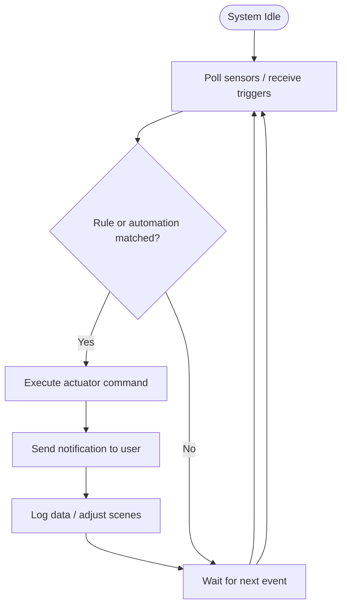

---

## Industrial hazard prevention system

**Block Diagram**
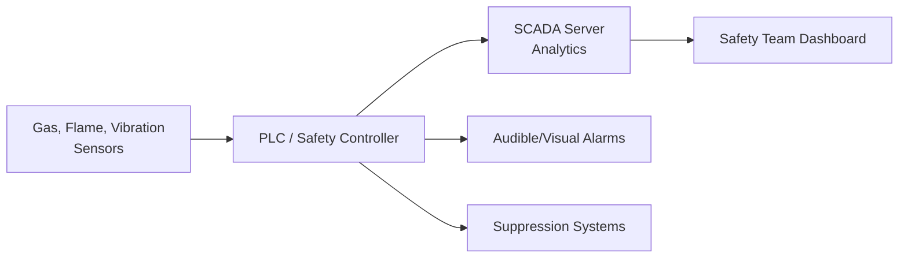

**Flowchart**
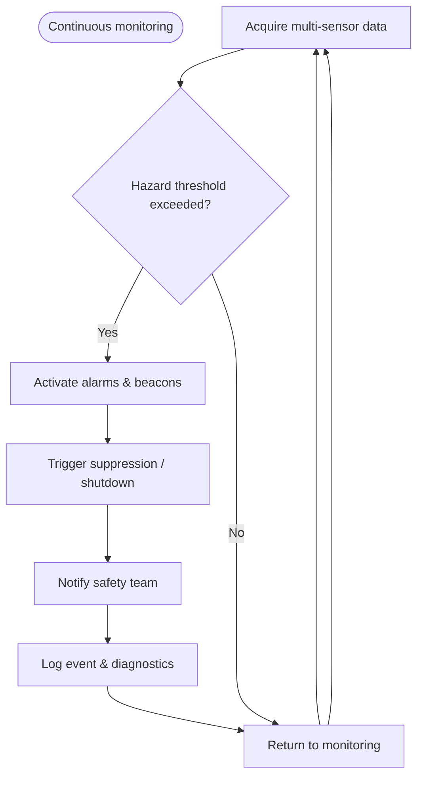

---

## Obstacle avoidance robot

**Block Diagram**
```mermaid
graph LR
    sensors[Lidar/Ultrasonic/IR Sensors]
    mcu[Microcontroller\n(Path Planning)]
    motor[Motor Driver]
    wheels[Drive Motors]
    feedback[Encoders / IMU]
    power[Battery Management]
    sensors --> mcu --> motor --> wheels
    wheels --> feedback --> mcu
    power --> mcu
```

**Flowchart**
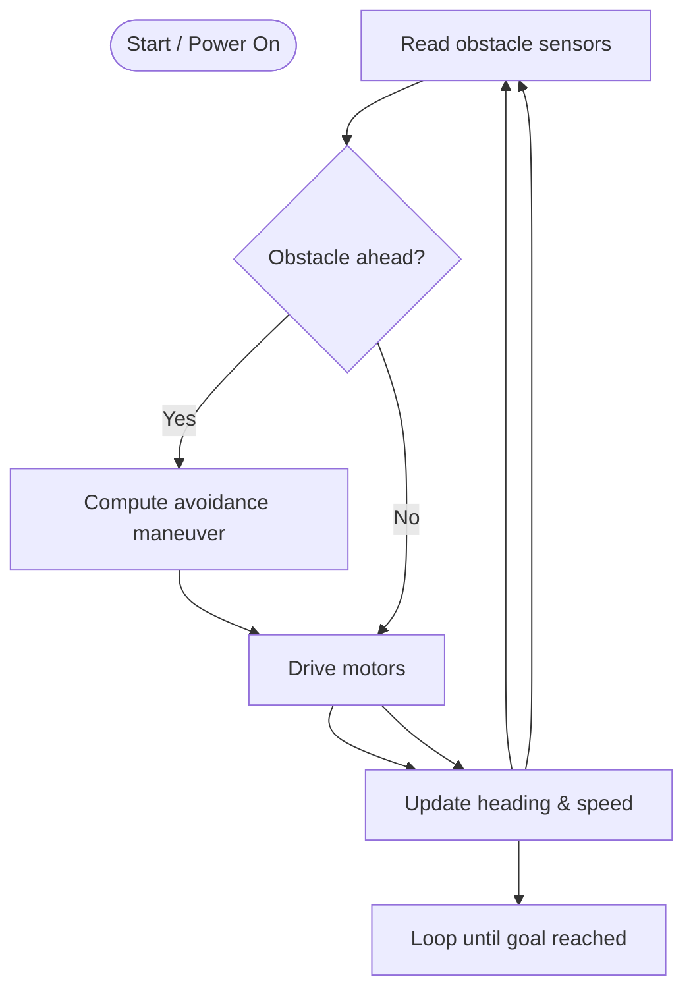

---

## Solar tracking system

**Block Diagram**
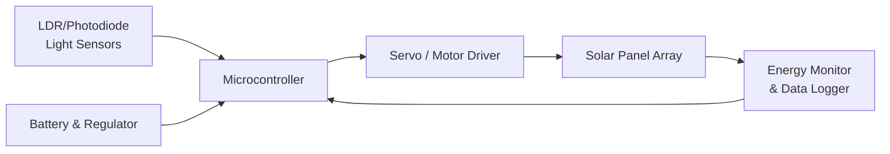

**Flowchart**
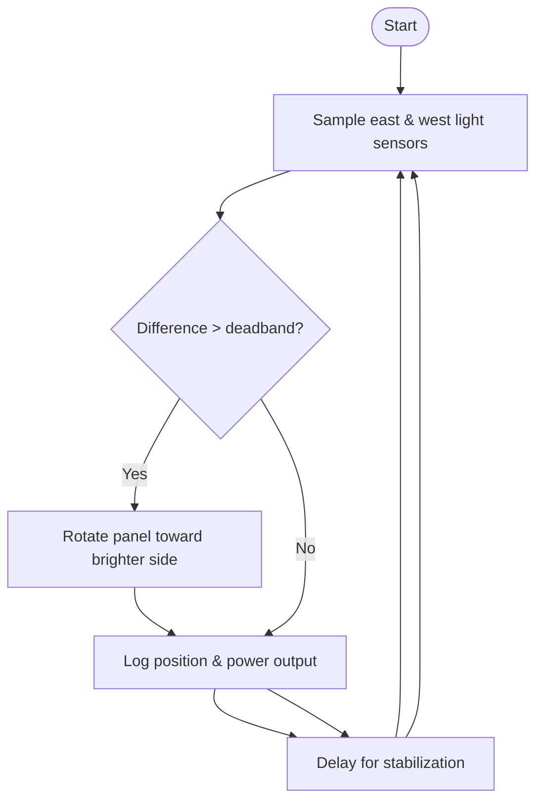

